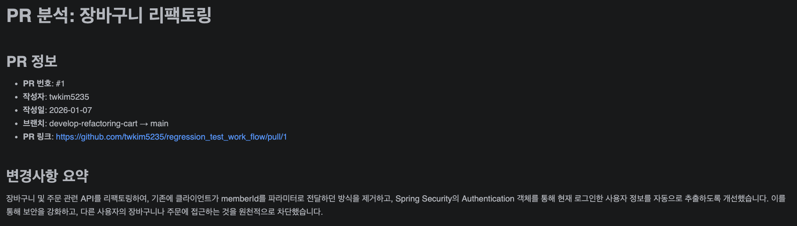
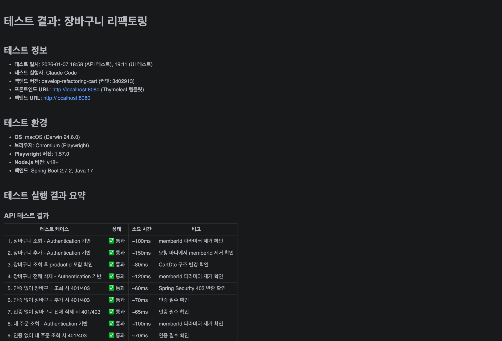
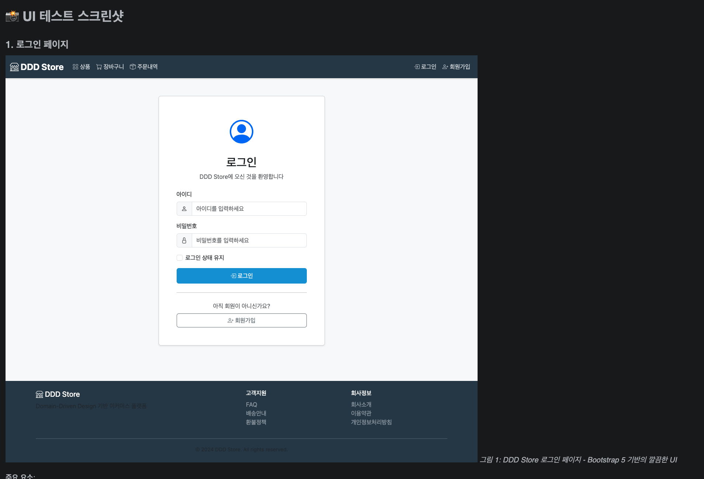

# Store Backend - Claude Code 자동화 워크플로우

Spring Boot DDD 기반 쇼핑몰 백엔드 + Claude Code 에이전트 자동화 시스템

## 프로젝트 개요

- **Tech Stack**: Spring Boot 2.7.2, Java 17, MySQL, QueryDSL
- **Architecture**: Domain-Driven Design (DDD)
- **자동화**: Claude Code 에이전트 기반 PR 분석, 테스트 생성/실행, 이슈 구현

## 자동화 워크플로우

### 1. PR QA 워크플로우

PR 분석부터 테스트 실행, 결과 리포팅까지 자동화된 품질 보증 프로세스

```
사용자: "PR #7 분석하고 테스트 실행해줘"
```

**워크플로우 순서:**
1. **pr-analyzer** → PR 변경사항 분석
2. **playwright-regression-test-generator** → 회귀 테스트 생성
3. **regression-test-runner** → 테스트 실행 (Git Worktree 사용)
4. **test-report-commenter** → PR에 테스트 결과 코멘트 게시
5. **test-result-analyzer** → 실패 분석 및 수정

### 2. GitHub Issue 워크플로우

이슈 분석부터 코드 구현까지 자동화

```
사용자: "이슈 #3 분석하고 구현해줘"
```

**워크플로우 순서:**
1. **github-issue-analyzer** → 이슈 분석 및 브랜치 생성
2. **issue-implementation-expert** → 코드 구현

## 에이전트 목록

| 에이전트 | 역할 |
|---------|------|
| `pr-analyzer` | PR 변경사항 분석, 리스크 평가 |
| `playwright-regression-test-generator` | Playwright 회귀 테스트 코드 생성 |
| `regression-test-runner` | 테스트 실행 및 결과 문서화 |
| `test-report-commenter` | PR에 테스트 결과 코멘트 게시 |
| `test-result-analyzer` | 테스트 실패 분석 및 수정 |
| `github-issue-analyzer` | GitHub 이슈 분석 및 브랜치 생성 |
| `issue-implementation-expert` | 이슈 기반 코드 구현 |
| `issue-workflow-coordinator` | 이슈 분석→구현 워크플로우 조율 |

## 사용 방법

### 1. Claude Code 실행

```bash
claude
```

### 2. PR QA 진행

```
# PR 분석 및 테스트 실행
PR #7 분석하고 테스트 실행해줘

# PR URL로도 가능
https://github.com/owner/repo/pull/123 테스트해줘
```

### 3. GitHub Issue 구현

```
# 이슈 분석 및 구현
이슈 #3 분석하고 구현해줘

# 이슈 URL로도 가능
https://github.com/owner/repo/issues/42 구현해줘
```

## 결과물 디렉토리 구조

```
regression-tests/
├── playwright-tests/
│   └── tests/
│       └── {domain}/
│           └── *.spec.ts          # 생성된 테스트 코드
└── pr-results/
    └── PR-{N}/
        ├── analysis-report.md     # PR 분석 리포트
        ├── regression-test-report-*.md  # 테스트 실행 결과
        ├── SUMMARY.md             # 요약
        └── screenshots/           # 테스트 스크린샷
```

## 테스트 결과 예시

### PR 분석 리포트


### 테스트 실행 결과


### 스크린샷 증거


## Git Worktree 사용

PR 브랜치 테스트 시 `.claude/agents/` 설정을 유지하기 위해 Worktree를 사용합니다:

```bash
# 현재 디렉토리: 에이전트 설정 유지, 테스트 코드 실행
# Worktree 디렉토리: PR 브랜치 서버 실행
```

자세한 내용은 [CLAUDE.md](./CLAUDE.md)의 "PR QA 워크플로우" 섹션 참조.

## 프로젝트 구조

```
store/
├── .claude/
│   └── agents/                    # Claude Code 에이전트 설정
├── src/
│   └── main/java/.../             # Spring Boot 애플리케이션
├── regression-tests/
│   ├── playwright-tests/          # Playwright 테스트 코드
│   └── pr-results/                # PR별 테스트 결과
├── CLAUDE.md                      # Claude Code 프로젝트 가이드
└── README.md
```
